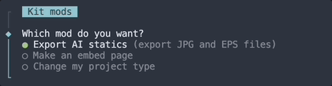

Graphics kit mods are low or no-code commands to update or add to your project.

To use one, run the `mods` command in your project.

```console
pnpm mods
```

## Available mods



### Change project type

Switch your [project type](/bluprint_graphics-kit/developers/project-structure/#project-type) to **embeds-only** or back to **pages+**.

### Convert to blog format

Convert a graphics-kit project into the blog format. Do this with a fresh project, not with an existing project you want to keep, as it will make large changes to your project structure and files.

This mod will:

- Replace the [pages route structure](developers/project-structure/#pages) with blog-style routes, including dynamic post pages.
- Replace `src/lib/App.svelte` with a minimal `src/lib/Post.svelte` blog post component.
- Rewrite `rngs-io.json` to point at storyboard `clrkyrv3j0003jw084m0t3nd4`.

### Make ai2svelte embeds

Make an embeddable page for an Adobe Illustrator graphic.

This command can only be run _after_ you've exported your graphic from Adobe Illustrator file using ai2svelte.

### Export AI statics

Export JPG and EPS static versions of an Adobe Illustrator graphic.
